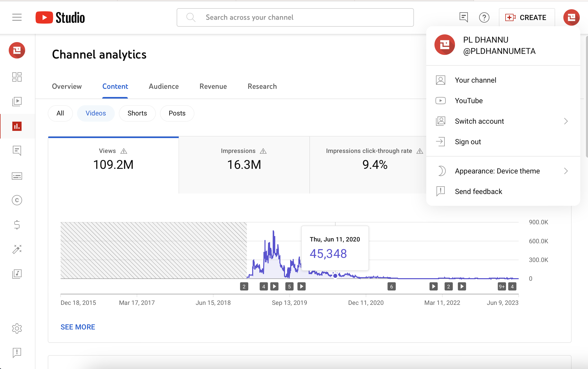

A web app for visualizing personalized Spotify data. View your top artists, top tracks, recently played tracks, and detailed audio information about each track. Create and save new playlists of recommended tracks based on your existing playlists and more.
